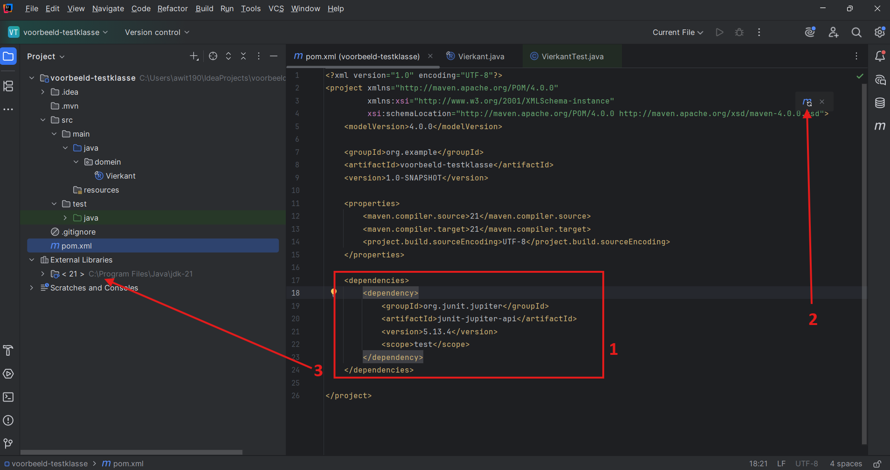
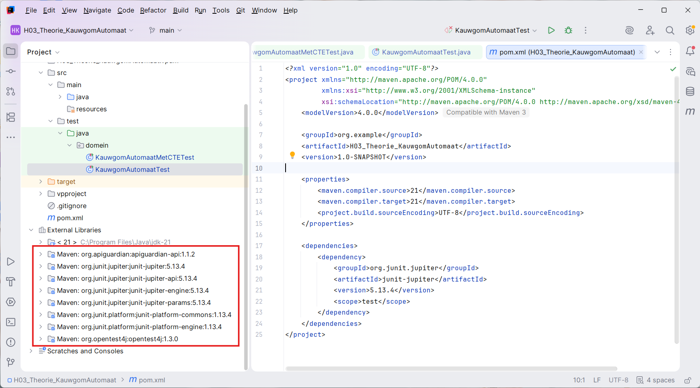
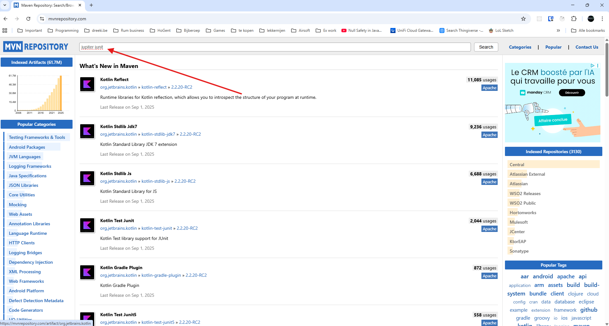
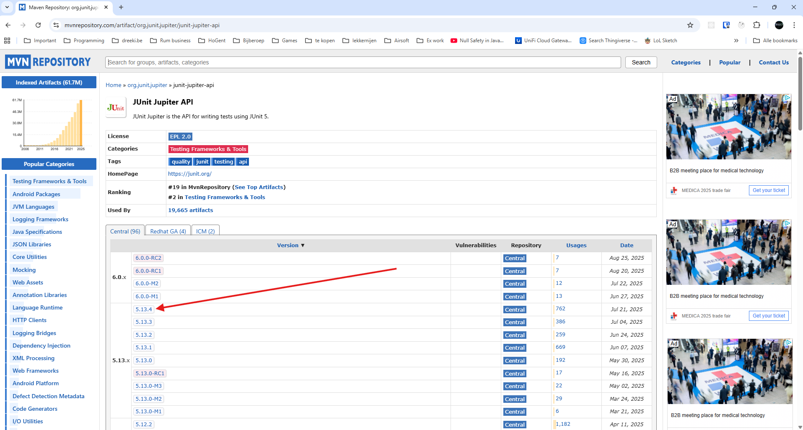
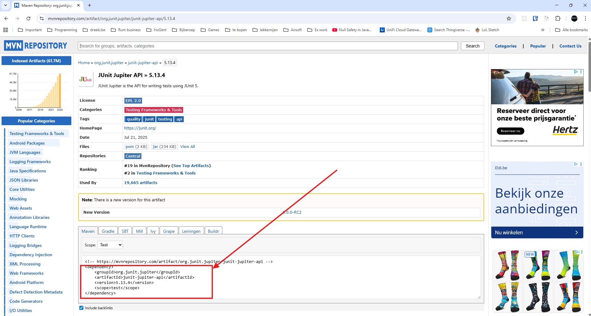
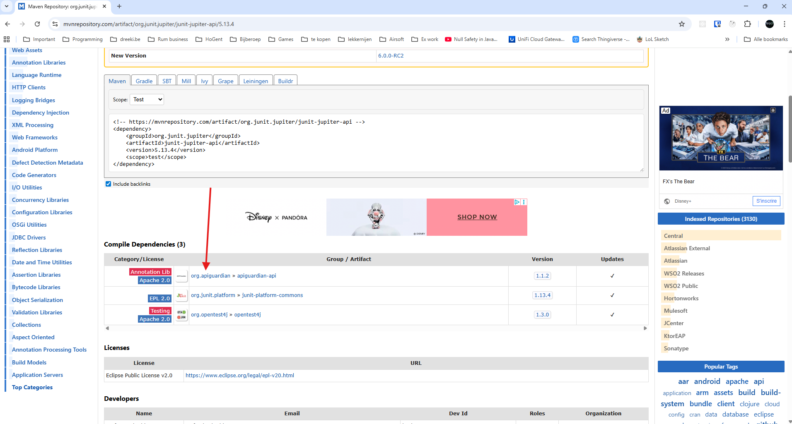

---
---
# Dependencies toevoegen

## 1. Basis: de vereiste dependencies voor JUnit (tests) en JavaFX (grafische projecten) toevoegen

### 1.1. Een project met tests, maar zonder JavaFX (niet grafisch)

1. Open de `pom.xml` van je project en plak onderstaande code net voor `</project>`:

   ```xml
   <dependencies>
       <dependency>
           <groupId>org.junit.jupiter</groupId>
           <artifactId>junit-jupiter</artifactId>
           <version>5.13.4</version>
           <scope>test</scope>
       </dependency>
   </dependencies>
   ```
   
2. Sla het bestand op. IntelliJ detecteert de wijziging en toont een sync-icoon. Klik hierop om een Maven sync uit te voeren.

    

3. Na synchronisatie zie je onder "External Libraries" niet alleen de toegevoegde dependency, maar ook de transitieve dependencies. Dit zijn extra libraries die jouw dependency nodig heeft.

    

### 1.2. Een project met tests en JavaFX (grafisch)

Volg precies dezelfde stappen als hierboven, maar plak onderstaande dependencies in je `pom.xml` net voor `</project>`:

```xml
<dependencies>
    <dependency>
        <groupId>org.openjfx</groupId>
        <artifactId>javafx-controls</artifactId>
        <version>21.0.6</version>
    </dependency>
    
    <dependency>
        <groupId>org.openjfx</groupId>
        <artifactId>javafx-fxml</artifactId>
        <version>21.0.6</version>
    </dependency>

    <dependency>
        <groupId>org.junit.jupiter</groupId>
        <artifactId>junit-jupiter</artifactId>
        <version>5.13.4</version>
        <scope>test</scope>
    </dependency>

</dependencies>
```

Vergeet de synchronisatie niet!

Merk op: in principe heb je de `javafx-fxml` dependency alleen nodig als je met Scene Builder gaat werken, en de `junit-jupiter` dependencies alleen als je JUnit tests gaat runnen. Je mag die dependencies weglaten, maar het levert ook geen problemen als je deze laat staan.


## 2. Extra: zelf geschikte dependencies zoeken en toevoegen

1. Ga naar de [Maven repository](https://mvnrepository.com) en zoek de dependency die je nodig hebt, bijvoorbeeld "jupiter junit".

    

2. Kies uit de lijst de juiste dependency die overeenkomt met wat je zoekt.

    

3. Selecteer de gewenste versie. Vermijd versies met "-M" (Milestone) of "-RC" (Release Candidate), omdat dit voorlopige versies zijn. Kies bij voorkeur een stabiele versie om later updaten makkelijker te maken.

    

4. Kopieer het dependency-blok dat Maven repository toont.

    

5. Open je `pom.xml` en zorg dat er een `<dependencies>`-element staat (net voor `</project>`):

   ```xml
   <dependencies>
   
   </dependencies>
   ```

6. Plak het gekopieerde dependency-blok binnen deze `<dependencies>` tag.

7. Sla het bestand op. IntelliJ detecteert de wijziging en toont een sync-icoon. Klik hierop om een Maven sync uit te voeren.

    

8. Na synchronisatie zie je onder "External Libraries" niet alleen de toegevoegde dependency, maar ook de transitieve dependencies. Dit zijn extra libraries die jouw dependency nodig heeft.

    

9. Deze transitieve dependencies kan je ook terugvinden in Maven repository, onderaan de pagina van de gekozen dependency.

    