---
---
# Een bestaand Eclipse-project of een src-map openen

Je herkent een Eclipse-project aan het `.project`-bestand in de hoofdmap. Ook als je enkel de `src`-map kreeg bij een oefening, kun je onderstaande stappen uitvoeren.

## 1. Controleer of het om een grafisch project gaat

Open de `src`-map: zit hier een package (folder) `gui` in? Dan is dit een grafisch project. Volg de stappen onder [Een grafisch (JavaFX) project openen](#2-een-grafisch-javafx-project-openen).

Indien het package `gui` niet aanwezig is, is dit een niet-grafisch project. Volg de stappen onder [Een niet-grafisch project openen](#1-een-niet-grafisch-project-openen).

## 2. Een niet-grafisch project openen

### 2.1. Algemeen

1. Maak een nieuw Maven-project in IntelliJ (zie *Een project maken (zonder JavaFX)*). Laat dit open staan. 
2. Open (buiten IntelliJ) de map met je Eclipse-project en navigeer naar de map `src`.
3. Copy-paste alle submappen (domein, main, ...) **behalve** testen naar `main/java` in je nieuw project dat open staat in IntelliJ:

    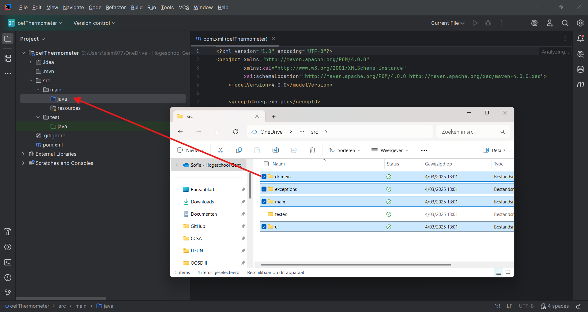

4. Er verschijnt een dialoogvenster. Bevestig met **Refactor**.
5. De bestanden staan nu onder `main/java`:

    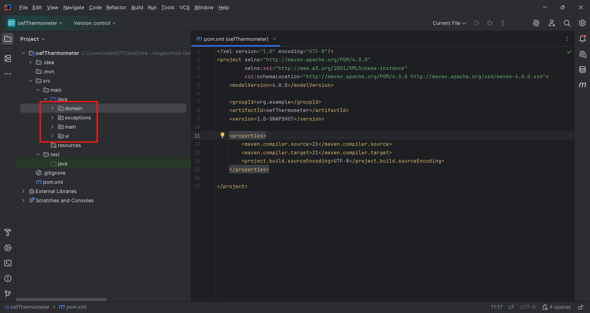

### 2.2. Als het project testen bevat

In Maven _moeten_ de tests in een package komen met dezelfde naam als het package waarin de te testen klasse staat. Als je bv. een test hebt voor een klasse in het package `domein`, maak dan het package `domein` ook onder `test/java` en zet de bijhorende tests in dat package. Hieronder staat hoe je dit kan doen:

1. Rechterklik op de java-map, New > Package

    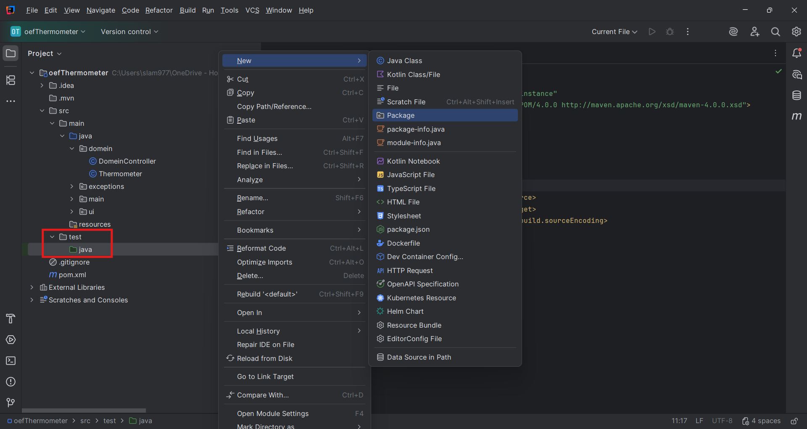

2. Geef het package de juiste naam en bevestig met Enter.

    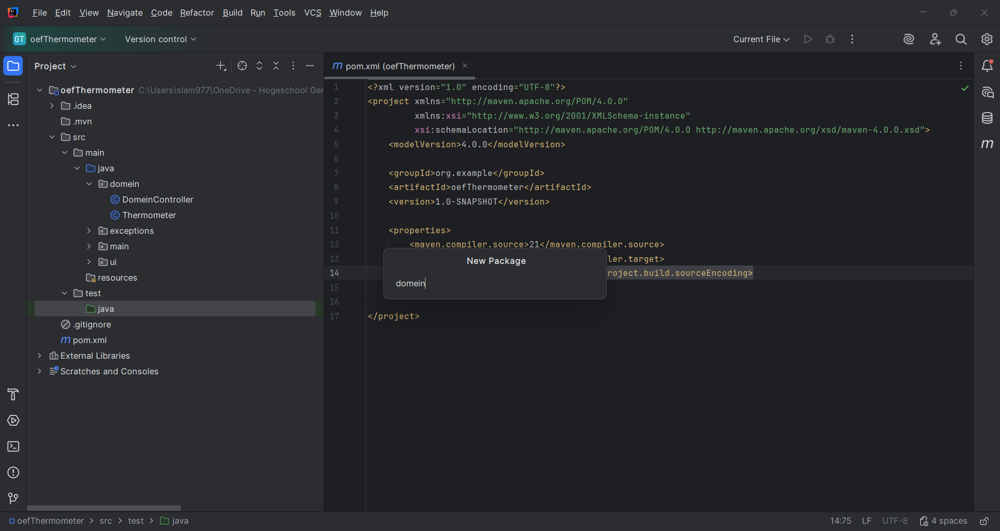

3. Herhaal bovenstaande stappen als er ook tests zijn voor klassen uit andere packages (bv. `util`).

4. Copy-paste de inhoud van de map `testen` naar het juiste package onder `test/java` in je project in IntelliJ. 

    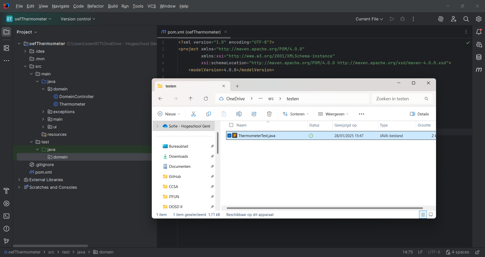

5. Bevestig opnieuw met **Refactor**.

6. Controleer dat je test zich op dezelfde plaats in de mappenstructuur bevindt als de te testen klasse:

    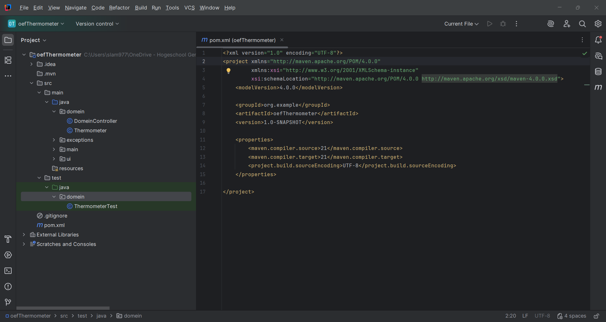

7. Vul de JUnit dependencies aan in de `pom.xml`: plak onderstaande code net _voor_ `</project>`:

   ```xml
   <dependencies>
       <dependency>
           <groupId>org.junit.jupiter</groupId>
           <artifactId>junit-jupiter</artifactId>
           <version>5.13.4</version>
           <scope>test</scope>
       </dependency>
   </dependencies>
   ```

8. Sla het `pom.xml` bestand op. IntelliJ detecteert de wijziging en toont een sync-icoon. Klik hierop om een Maven sync uit te voeren (meer informatie over het toevoegen van dependencies vind je onder *Dependencies toevoegen*):

    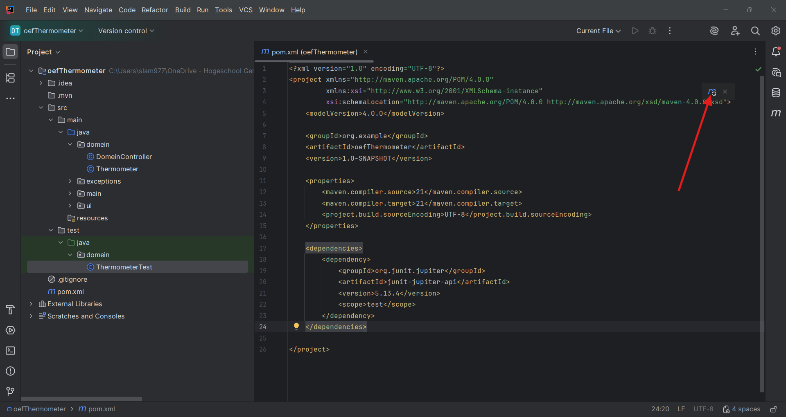


9. Je ziet dat het icoontje bij de test er nu anders uitziet omdat de JUnit test herkend wordt. Je kan deze uitvoeren met rechterklik op het testbestand > Run 'TestKlasse':

    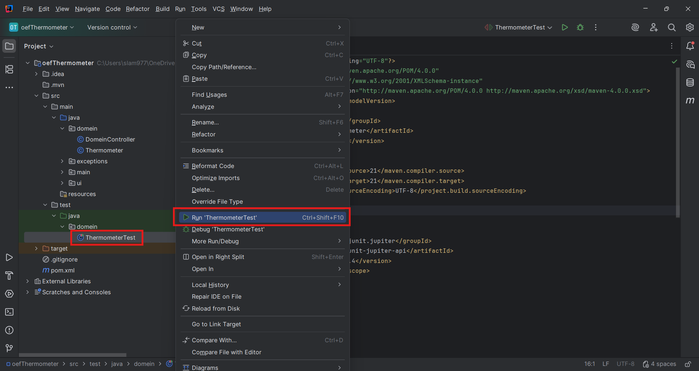

    De resultaten van de tests verschijnen onderaan in het Run tool window.

    Tip: als je meerdere JUnit-testbestanden hebt, kun je alle tests tegelijk laten uitvoeren door rechterklik op de java-map onder test > Run 'All Tests':

    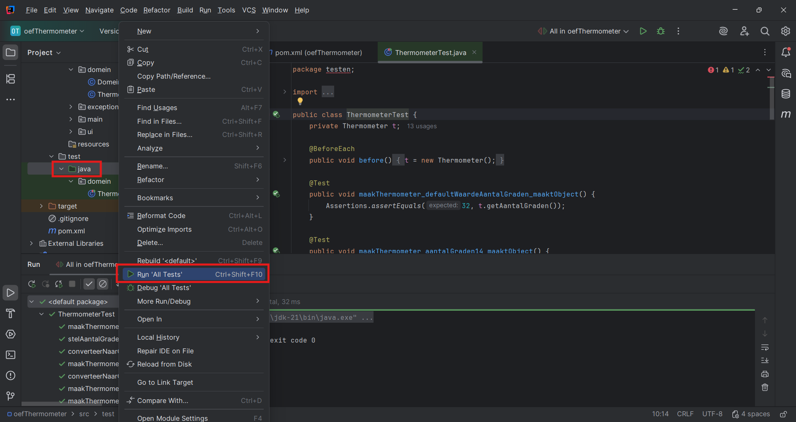

10. Om de code in het project uit te voeren, run je simpelweg de code in het StartUp-bestand. Dit kan op de manieren beschreven onder *Runnen en debuggen*.

## 3. Een grafisch (JavaFX) project openen

### 3.1. Algemeen

Volg onderstaande stappen:

1. Maak een JavaFX-project via File > New > Project... (zie ook *Een JavaFX-project maken*). Selecteer de juiste opties en geef je project een naam.

    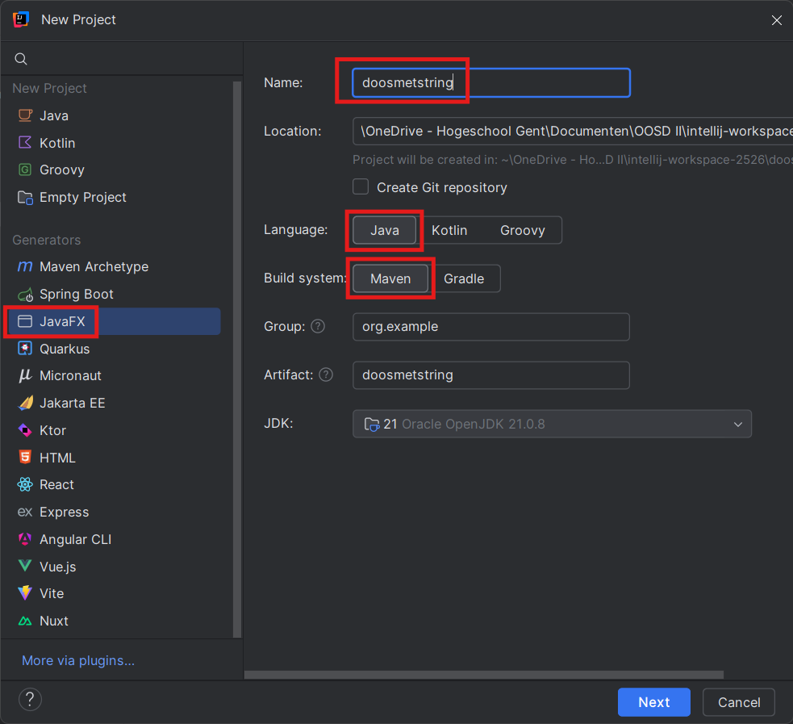

    Klik op **Next** en vervolgens op **Create**.

2. Verwijder onder `main/java` alle bestanden en ook het package `org.example.<projectnaam>`:

    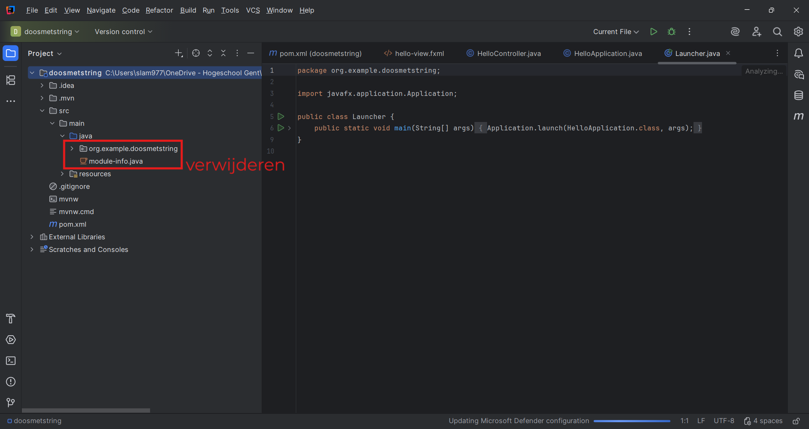

3. Copy-paste alle niet-testbestanden (in hun packages) uit src naar de java-map in IntelliJ. Bevestig met **OK**.

    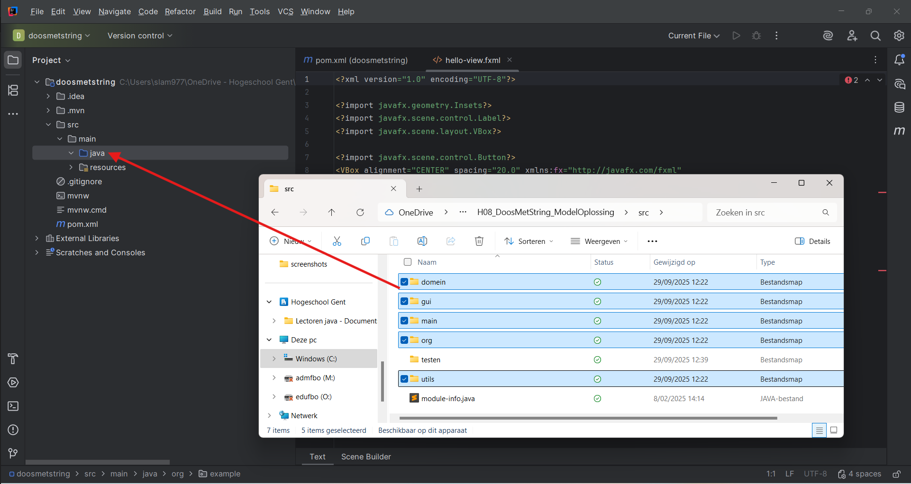

4. Pas `pom.xml` aan zodat onder `<mainClass>` de StartUp-klasse vermeld wordt:

   ```xml
   <mainClass>main.StartUp</mainClass>
   ```

    Bewaar en doe een Maven synchronisatie.

    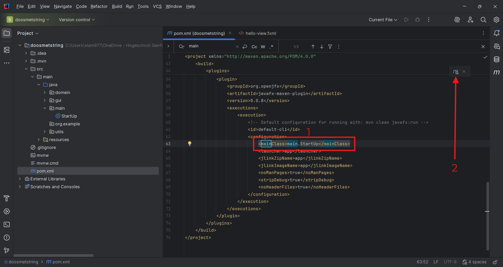

5. Om het project te runnen, moet je nog een correcte Maven runconfiguratie maken. Volg hiervoor de stappen onder *Een JavaFX-project maken*, die zijn samengevat in onderstaand screenshot:

    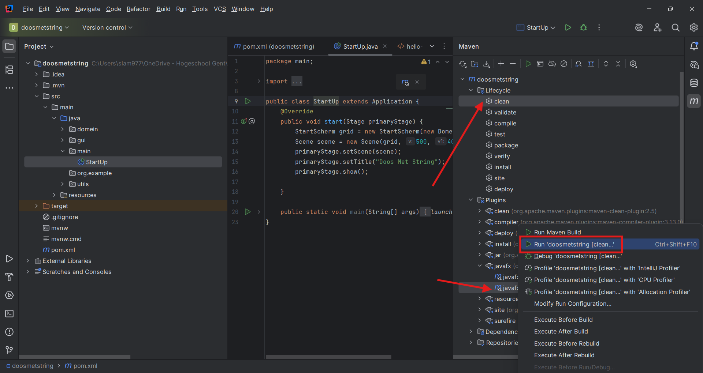


### 3.2. Als het project testen bevat

1. Je ziet dat de test-map ontbreekt in de standaard mappenstructuur van een JavaFX-project. We gaan deze toevoegen. Rechts-klik op de `src`-map en selecter New > Directory:

    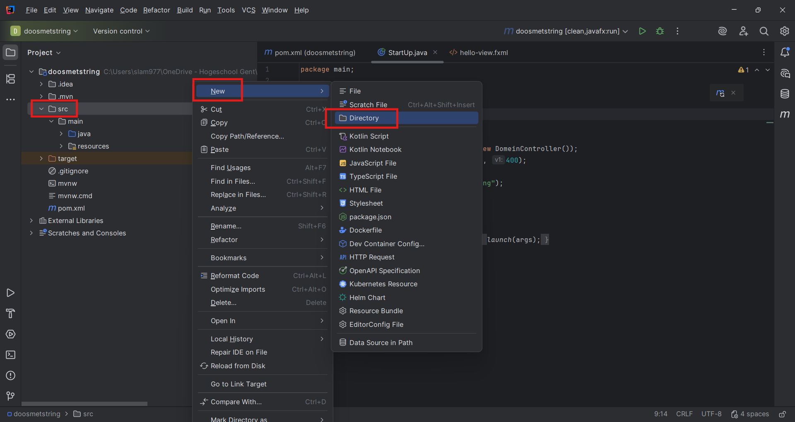

2. In het pop-upvenster selecteer je "test\\java". Bevestig met Enter.

    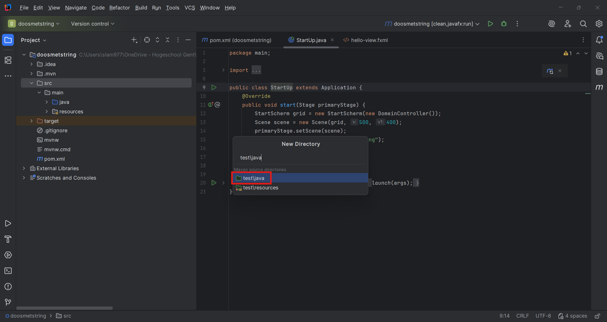

3. Kijk voor welke klassen tests aanwezig zijn in het Eclipse-project. Zorg dat al hun packages aanwezig zijn in de java-map onder test. Maak ze aan met rechts-klik > New > Package:

    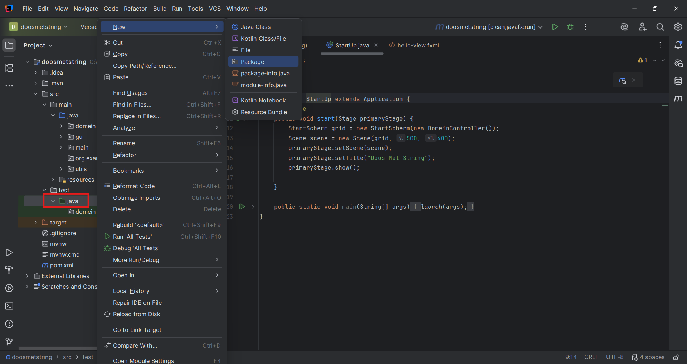

4. Nu kun je de tests uit het bestaande project copy-pasten naar de juiste locatie:

    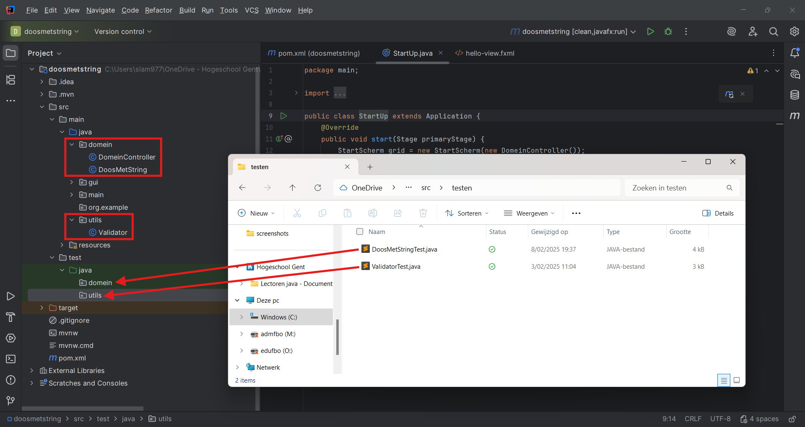

Als je een waarschuwing krijgt bij het overzetten van een testbestand, klik op **Refactor anyway**. 

### 3.3. Foutmeldingen in de testklassen

Als je testklasse gebruik maakt van geparametriseerde tests, krijg je bij de imports mogelijk de foutmelding "Cannot resolve symbol 'params'". Dit wijst erop dat de dependency voor `params` ontbreekt in `pom.xml`. Vervang de JUnit dependencies (let wel: enkel de JUnit dependencies!) door onderstaande:

   ```xml
   <dependencies>
       <dependency>
           <groupId>org.junit.jupiter</groupId>
           <artifactId>junit-jupiter</artifactId>
           <version>5.13.4</version>
           <scope>test</scope>
       </dependency>
   </dependencies>
   ```

Bewaar en voer de Maven synchronisatie uit.

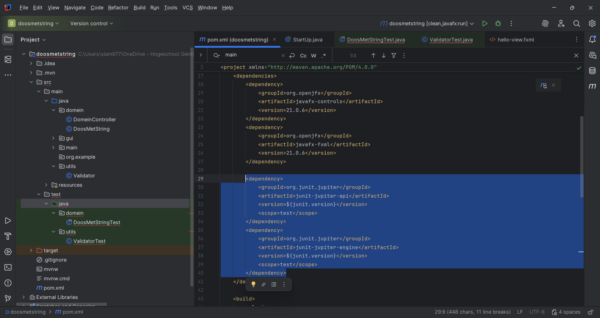

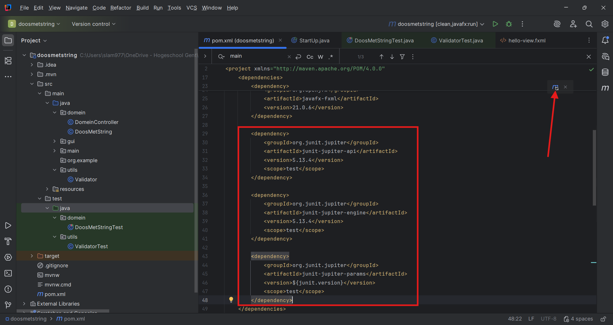

Nu kun je de tests uitvoeren zoals beschreven in de sectie over niet-grafische Eclipse projecten.