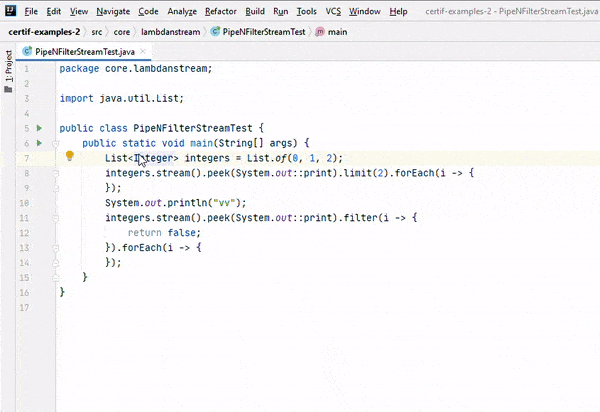

---
---
# Enkele onmisbare sneltoetsen

## Selecteren van tekst – uitbreiden van selectie

`Ctrl+w`: expand selection. Selecteert een steeds groter codeblok:

(bron afbeelding: [https://blog.vvauban.com](https://blog.vvauban.com/blog/intellij-shortcut-ctrl-w-select-word-at-caret))

Als je bijvoorbeeld alle parameters in een functie-aanroep wil aanpassen, dan zet je je cursor tussen de haakjes, en typ je een paar keer `Ctrl+w` tot je alles geselecteerd hebt. 

Met `Ctrl+Shift+w` kan je de selectie terug verkleinen.

## Zoeken in je project

`Ctrl+Shift+f`: dit is heel gelijkaardig aan `Ctrl+f`, maar dan in je volledige project. Je kan met deze sneltoets ook zoeken in enkel bestanden met een bepaalde extensie, of binnen een bepaalde map.

## Overal zoeken (search everywhere)

`Shift+Shift`: opent een zoekbalk waarmee je niet alleen kan zoeken in je huidige project, maar ook in menu-acties, instellingen, en tools. Stel dat je een instelling wil aanpassen of een menu wil openen, maar je weet niet meer waar het stond. Dan vind je het met `Shift+Shift` snel terug.

## Overal zoeken (search everywhere)

Een volledig overzicht van de sneltoetsen in IntelliJ vind je bij de links.