---
---
# Configuratie IntelliJ

Start IntelliJ op.

## 1. VERPLICHT: inline completion uitschakelen

Tijdens het maken van oefeningen en op het examen is het gebruik van inline completion niet toegestaan.

Open het "Settings" menu met `Ctrl+Alt+S`.

Editor > General > Inline Completion > Enable local Full Line completion suggestions **uitschakelen**:

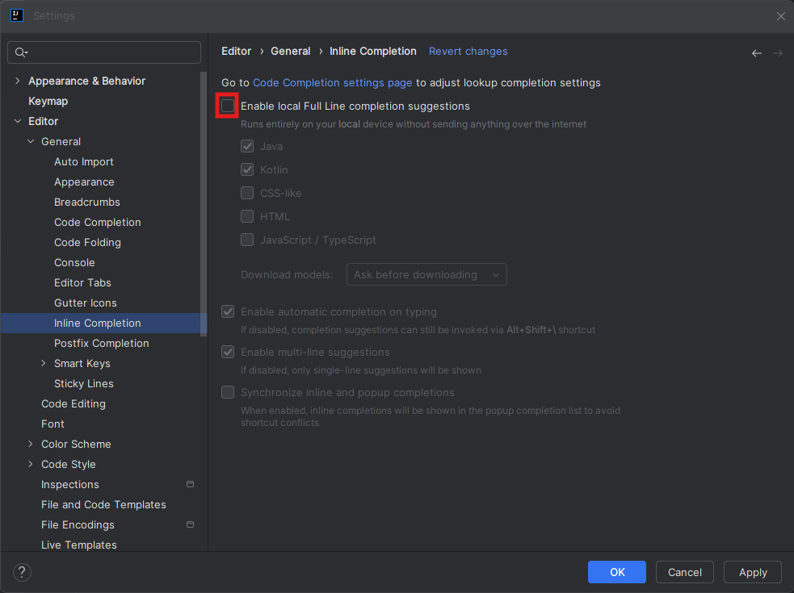

Bevestig met **OK**.

## 2. Weergave-opties in IntelliJ aanpassen

### 2.1. De menubalk weergeven wanneer je in een project werkt

Open het "Settings" menu met `Ctrl+Alt+S`.

Voeg de menubalk toe: Appearance & Behavior > Appearance > Main menu: Show above Main Toolbar

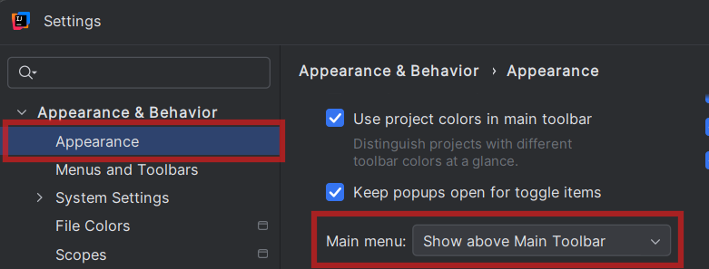

**Let wel:** op Windows zal het main menu enkel zichtbaar zijn wanneer een project geopend is. Voorlopig kun je dit dus nog niet zien.
Op zich is dit geen probleem, want je kan via de sneltoets `Shift+Shift` alle menu's en opties vinden.

### 2.2. Kleurschema kiezen (optioneel)

Gebruik de `Shift+Shift` sneltoets en zoek naar "editor color scheme", kies een thema:

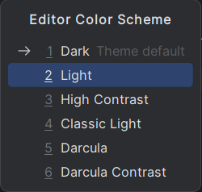

## 3. De JavaFX-plugin (nodig vanaf OOSDII hoofdstuk)

Gebruik de `Shift+Shift` sneltoets en zoek naar "plugins":

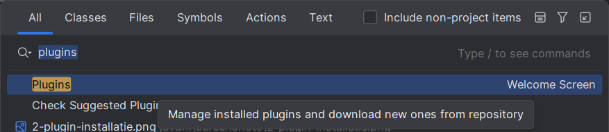

Typ "javafx" in de zoekbalk. Controleer of de JavaFX plugin geïnstalleerd en actief is:

- het vinkje staat aan (indien niet: klik op "Install")
- de plugin is _enabled_ (op de knop staat "Disable", dat wijst erop dat de plugin actief is)

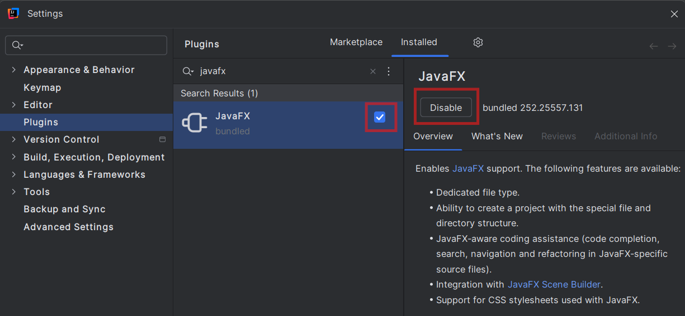

## 4. Je workspace instellen

Maak een nieuwe folder, bv. `Documenten\OOSDII\intellij-workspace-2526`, die je als workspace zal gebruiken.

Om ervoor te zorgen dat jouw workspace standaard geopend wordt, kun je in "Default project directory" het pad van je workspace instellen. Open het "Settings" menu met `Ctrl+Alt+S`. Ga naar Appearance & Behavior > System Settings en kopieer het pad van je net gemaakte map naar de instelling "Default project directory":

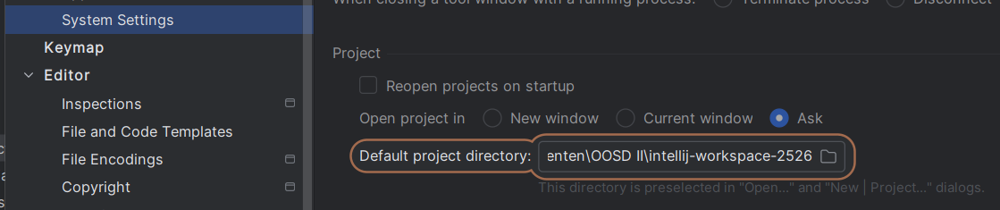

## 5. Standaardoptie voor openen van een project

Je kan maar één project tegelijk openen in een instantie van IntelliJ. Wanneer je een ander project opent, krijg je standaard een dialoogvenster te zien:

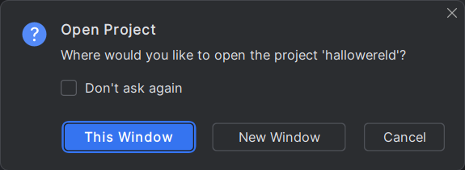

Als je "This Window" kiest, wordt het huidige project gesloten en wordt het nieuwe project in je huidige venster geopend. Kies je voor "New window", dan opent het nieuw aangemaakte project in een apart venster en blijft het huidige project ook open staan. 

Als je vaak meerdere projecten tegelijk open wil hebben, kan het handig zijn om deze standaard in een nieuw venster te openen.

Je kan een standaardoptie selecteren door "Don't ask again" aan te vinken. Je kan die altijd nog terug wijzigen in de "Settings" menu (`Ctrl+Alt+S`) onder Appearance & Behavior > System Settings:

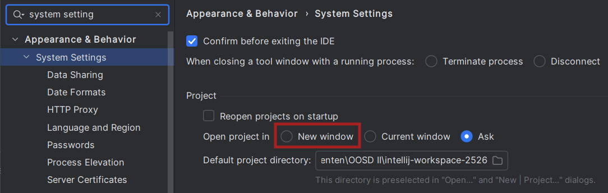

## 6. Scene Builder integreren

Open het "Settings" menu met `Ctrl+Alt+S`. Ga naar Languages & Frameworks > JavaFX en geef het pad in naar je SceneBuilder.exe:

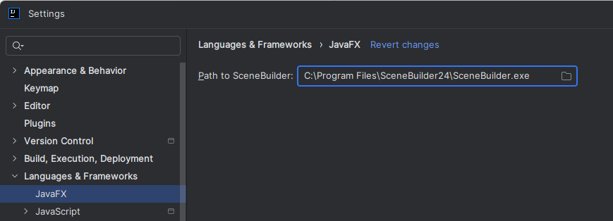

Bevestig met OK.

## 7. Visual Paradigm integreren (optioneel, niet nodig voor OOSDII)

Sluit IntelliJ en Visual Paradigm af.

Ga naar `C:\Users\je naam`, geef verborgen items weer:

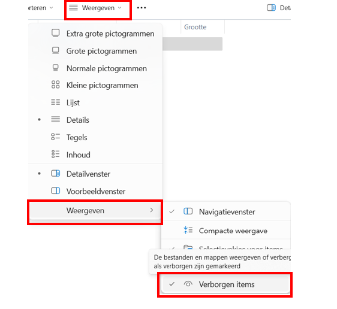

De map AppData is nu zichtbaar. Navigeer naar:

Voer Visual Paradigm als administrator uit:

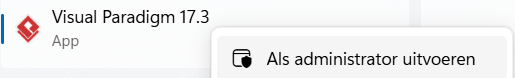

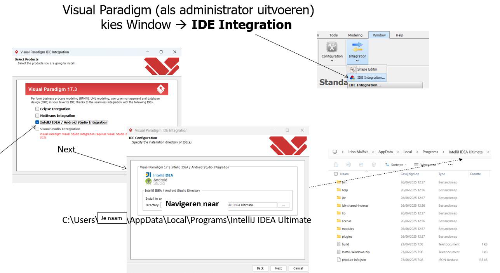

Sluit Visual Paradigm af.

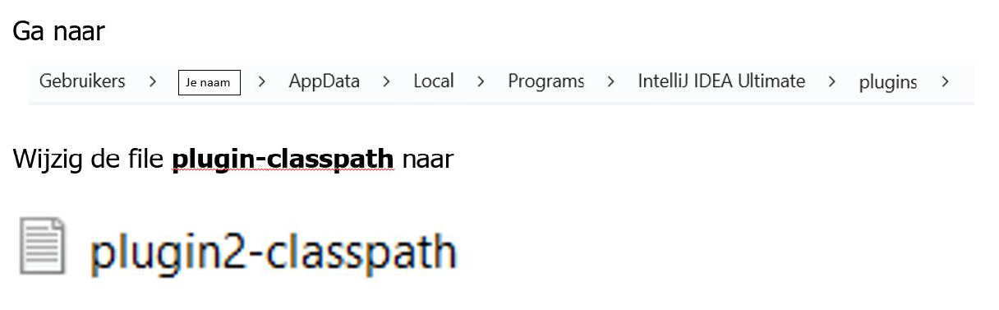

Start IntelliJ op. Wanneer je een Java-project geopend hebt, kun je nu de integratie met Visual Paradigm gebruiken door rechts te klikken op het project, of via het Tools-menu:

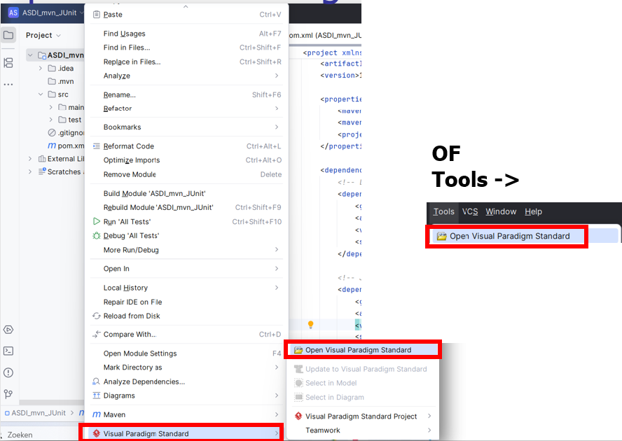

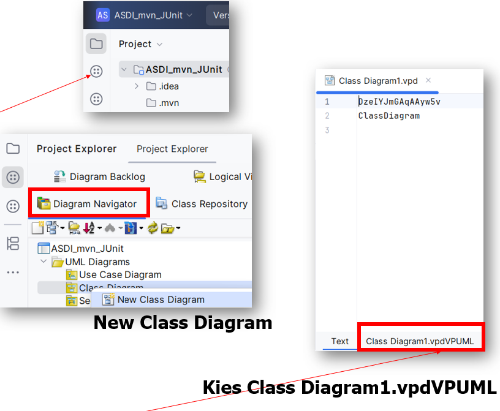