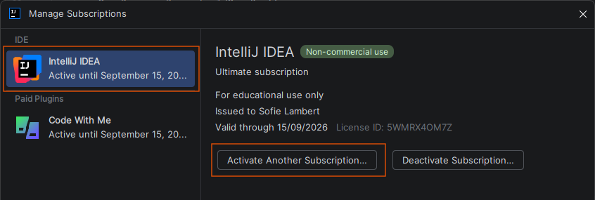

---
---
# Licentie achteraf toevoegen

Zoek met `Shift+Shift` naar "Manage Subscriptions...". Selecteer "IntelliJ IDEA" en klik op "Activate Another Subscription...":

Meld je aan met je githubaccount dat je gekoppeld hebt aan jetbrains.