---
---
# Een JavaFX-project maken

Binnen deze handleiding zijn er 2 secties: 

1. [Een JavaFX-project aanmaken](#1-een-javafx-project-aanmaken)
2. [Verwijderen van `module-info.java` en het project runnen met behulp van Maven](#2-runnen-zonder-module-infojava) (aanbevolen maar niet noodzakelijk).

## 1. JavaFX-project aanmaken

Voor je je eerste project maakt: controleer of de JavaFX-plugin actief is (zie pagina *De JavaFX-plugin*).

Maak een nieuw project aan:

1. Kies in het project-aanmaakvenster voor **JavaFX**.
2. Vul een projectnaam in.
3. Selecteer bij Language: **Java** 
4. Selecteer bij Build system: **Maven**.
5. Klik op **Next** en vervolgens op **Create**.

    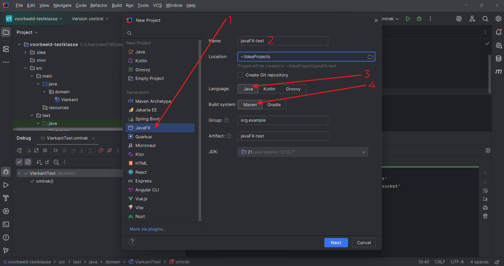

    Het project wordt aangemaakt met een `pom.xml` en een `module-info.java` (onder `src/main/java`). De `HelloApplication` kun je direct draaien via het play-icoon:

    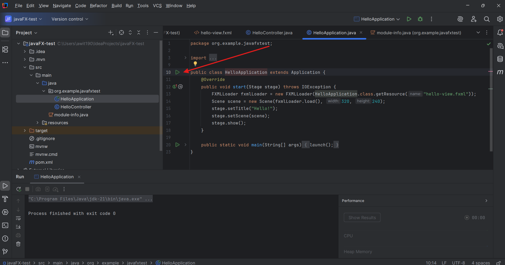

## 2. Runnen zonder `module-info.java`

Het is aanbevolen Maven-projecten zonder `module-info.java` te draaien om complicaties te vermijden. Dit vereist enkele configuratiestappen, maar daarna zul je simpelweg kunnen runnen met de run-knop rechtsboven.

1. Verwijder het bestand `module-info.java`: selecteer het bestand, klik op de Delete-toets en bevestig met OK.
2. Pas de inhoud van `pom.xml` aan: verwijder na `<mainClass>` de modulenaam, dit is de tekst voor de "/". Verwijder ook de "/". 

    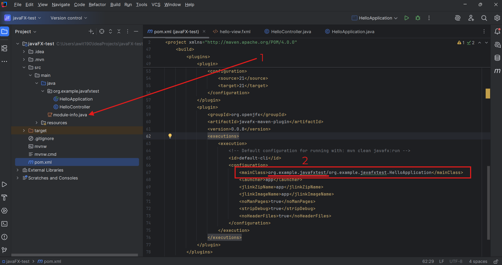  

3. Bewaar `pom.xml` en synchroniseer het project (Maven sync):

    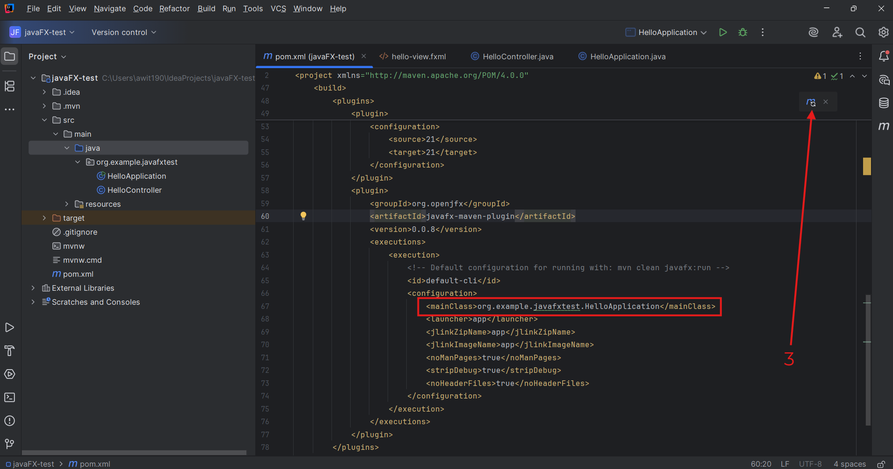

Om een eerste keer te runnen via Maven:

1. Open het Maven tool window (rechter zijbalk).
2. Selecteer de goals `clean` (onder Lifecycle) en `javafx:run` (onder Plugins > javafx) door CTRL + klikken.

    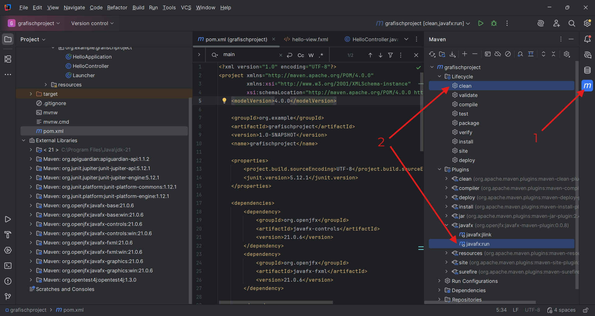 

3. Rechterklik op één van de geselecteerde lijnen en selecteer **Run 'projectnaam...'**:

    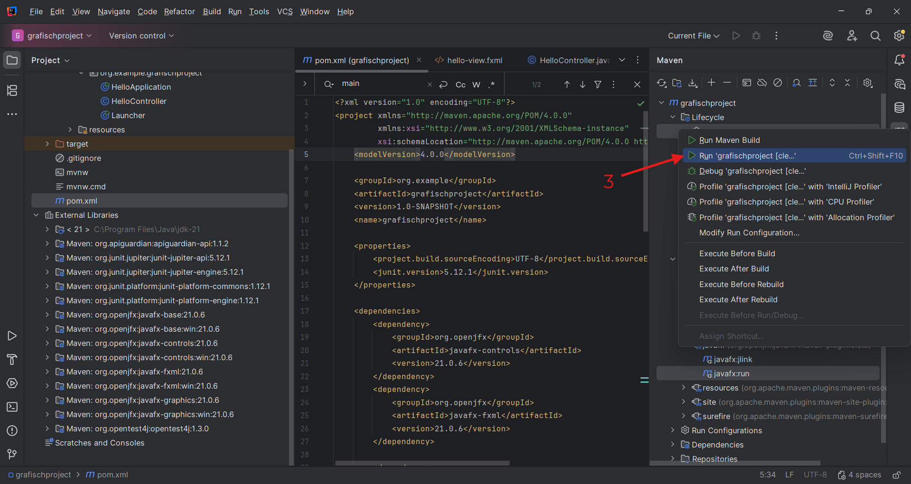

De JavaFX-applicatie start nu zonder `module-info.java`.

Eens je deze run hebt uitgevoerd, wordt die automatisch opgeslaan onder de runconfiguraties. Voortaan kun je deze selecteren uit de dropdown rechtsboven:

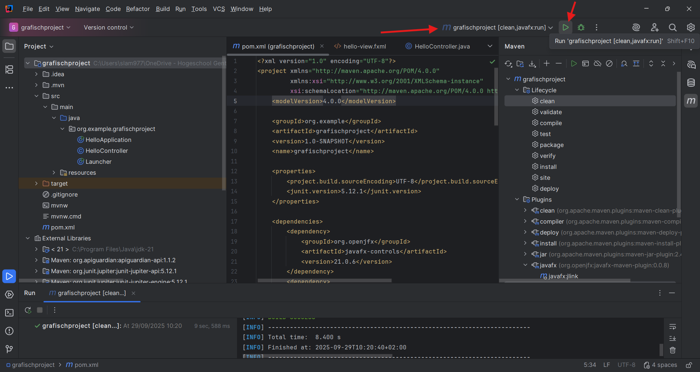

Let op: als je tests draait, wordt mogelijk een andere configuratie actief. Wissel dan terug naar deze configuratie om de applicatie te starten.

<!-- Onderstaande is overbodig na versie 2025.2.2 en als je in Maven de eerste keer runt met rechtermuisknop (niet met de run button!), want de Run-configuratie wordt automatisch aangemaakt.

## 3. Run-configuratie aanmaken

Het handmatig selecteren van `clean` en `javafx:run` is omslachtig. Maak een run-configuratie aan als je deze stappen niet telkens wil uitvoeren.

- Klik rechtsboven op de run-configuratie dropdown en kies **Edit Configurations...**.

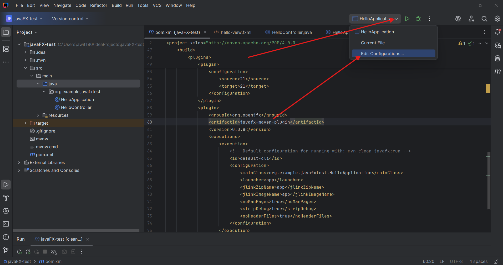

- Klik op het "+"-icoon en kies **Maven**.

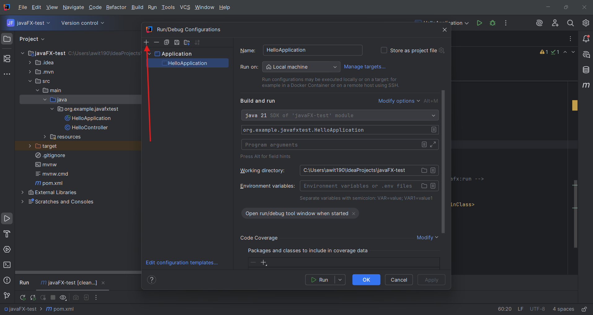  
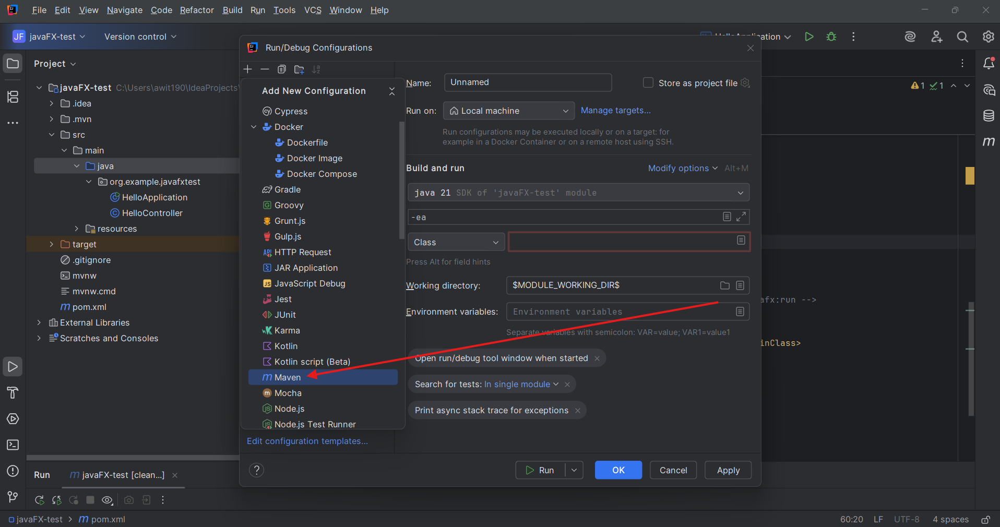

- Vul onder Name: een logische naam in, zodat je je run-configuratie later gemakkelijk kan herkennen.

- Vul onder Run in: `clean javafx:run`

- Klik op **Apply** en **OK**.

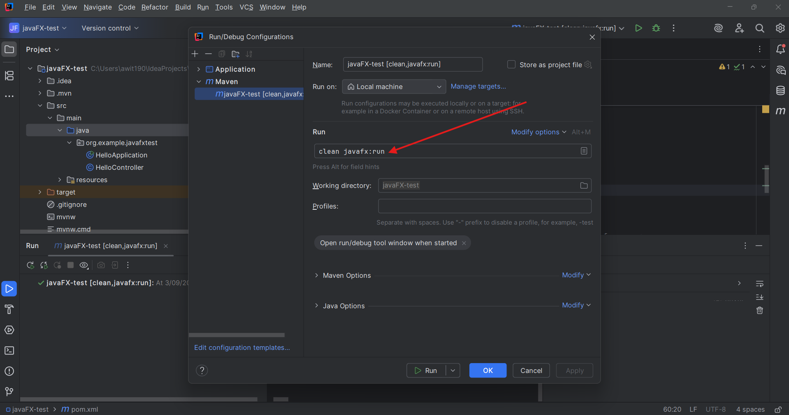

Nu staat deze nieuwe configuratie klaar om gebruikt te worden. Selecteer hem bij de run-configuraties als dat niet automatisch gebeurt:

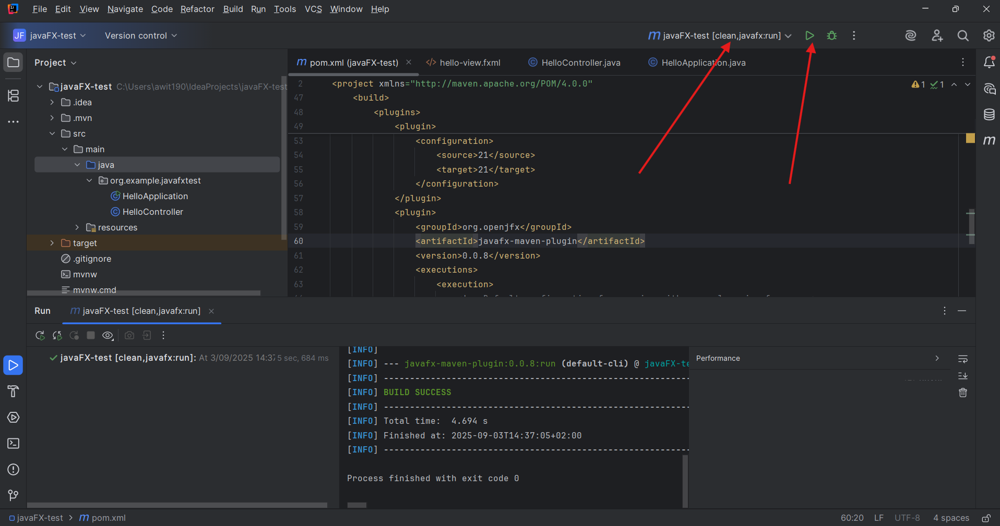

Let op: als je tests draait, wordt mogelijk een andere configuratie actief. Wissel dan terug naar deze configuratie om de applicatie te starten.

-->