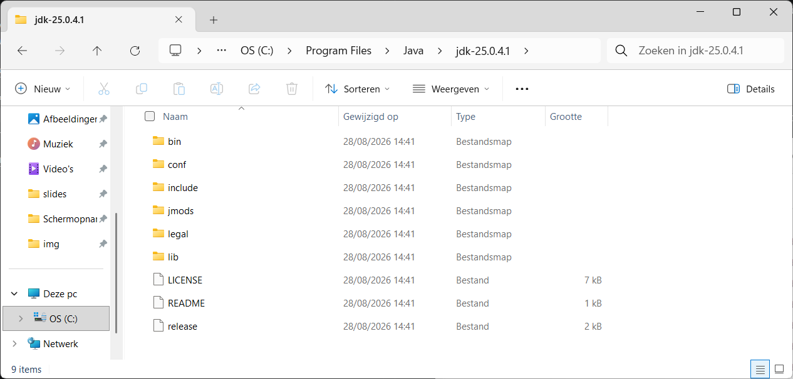

---
---
# Installatie JDK 25

Installeer de Java Development Kit versie 25. Installatiebestanden voor Linux, macOS en Windows zijn beschikbaar via deze link:

<https://www.oracle.com/europe/java/technologies/downloads/#java21>

Download de gepaste **Installer** en voer uit. 

Voorbeeld van een geslaagde installatie onder `Program Files` op Windows:

