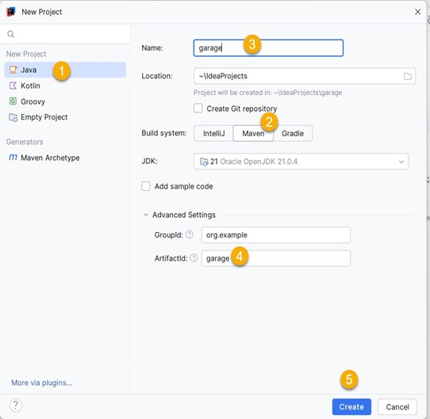

---
---
# Een project maken (zonder JavaFX)

Er zijn meerdere manieren om het **New Project** venster te openen:

- De eerste keer dat je IntelliJ opent, verschijnt er een startscherm met rechtsboven een knop **New Project**. Klik hierop om een nieuw project te maken.
- Je kan via de menubalk een nieuw project maken: ga naar **File** > **New** > **Project**. Soms wordt de menubalk niet weergegeven. Gebruik dan de sneltoets `Shift+Shift` en zoek naar "main menu". Open via die weg het **Main menu** en selecteer **New** > **Project**.

Het pop-upvenster laat je toe om een Maven-project aan te maken:

1. Selecteer links **Java**.

2. Bij **Build system** kies je voor **Maven** (voortaan werken we enkel nog met Maven-projecten). Vink het vakje **Add sample code** UIT.

3. Vul de projectnaam in. "Location" is de plaats waar het nieuwe project wordt opgeslagen. Als je de configuratiestappen hebt doorlopen, staat dit al juist ingesteld op je workspace.

4. Optioneel: klap de **Advanced Settings** open. Hier zie je dat de "GroupId" al ingevuld is als "org.example" (dit is de organisatie van het project). Dit kan je eventueel veranderen naar "be.hogent". Dit heeft geen invloed op de werking van het project. De "ArtifactId" wordt automatisch aangepast zodra je de projectnaam invult

5. Klik tot slot op **Create**.

Het nieuw aangemaakte project en het gegenereerde pom.xml-bestand worden geopend. 

In het linkerpaneel zie je de projectstructuur. Deze volgt de typische Maven-structuur:

- De src-map met daarin de main-map:

   -  In de main-map vind je een java-map en een resources-map.

    - De Java-bestanden komen in de java-map (in packages, die je kan aanmaken door rechterklik op de java-map > New > Package).

- De test-map met daarin een java-map:

    - In deze map ga je dezelfde mappenstructuur gebruiken als in main (enkel als je tests aanmaakt).

Als je JUnit tests wil gebruiken in je project, moet je nog de nodige dependencies opnemen. Instructies hiervoor vind je op de pagina over dependencies.