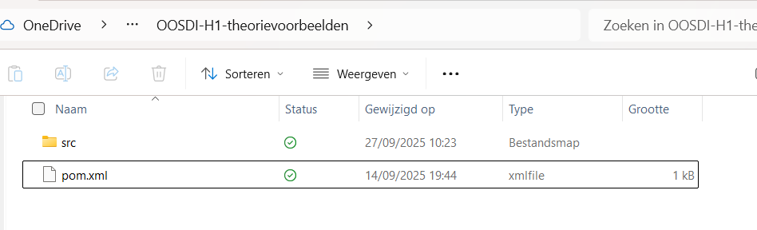
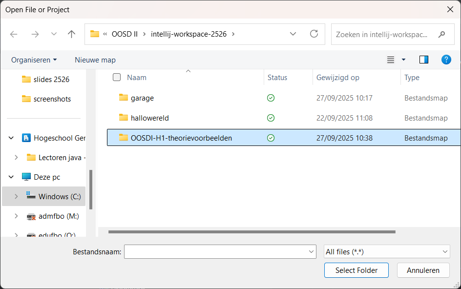
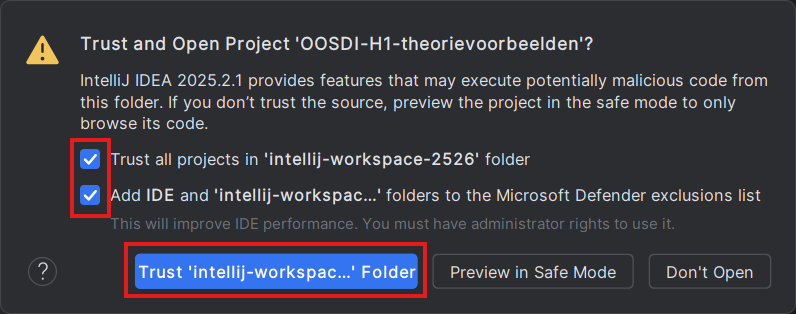

---
---
# Een gedownload Maven-project importeren

Een Maven-project kun je herkennen aan het feit dat in de hoofdmap naast de `src`-map ook een `pom.xml` bestand staat:

> ⚠️ Als `pom.xml` niet aanwezig is, volg dan de stappen onder [Een bestaand Eclipse-project of een src-map openen](/intellij-gids/eclipse-project-openen/eclipse-project-openen.md).

Open IntelliJ en ga in het Main menu naar File > Open...

De map die je als standaard worskpace hebt ingesteld in de configuratie, wordt geopend. Het is dus handig als je je te importeren project daar klaarzet.

Selecteer de hoofdmap (de map waarin de `src`-map en het `pom.xml` bestand staan, niet de `src`-map zelf!):

Bevestig met "Select Folder".

Mogelijk wordt gevraagd of je dit project vertrouwt. Vink aan dat je alle projecten in je workspace vertrouwt (op Windows vink je ook best de tweede optie aan):

Het project wordt geopend in IntelliJ. In het Project tool window (links) zul je zien dat er ook een .idea map aangemaakt is, waarin de projectinstellingen bewaard zijn.