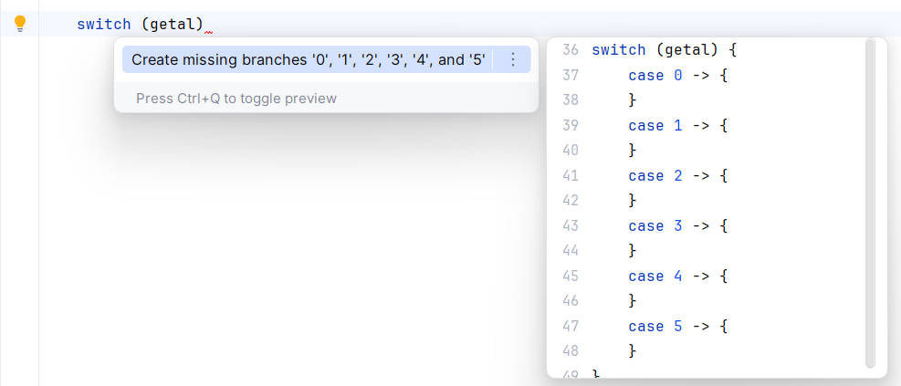
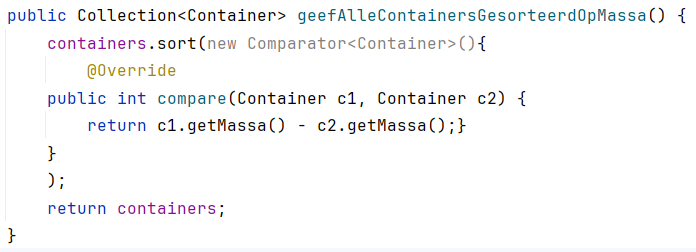
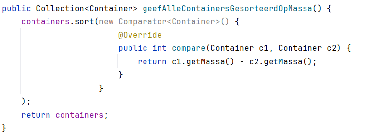

---
---
# Enkele onmisbare sneltoetsen

## Selecteren van tekst – uitbreiden van selectie

`Ctrl+w`: expand selection. Selecteert een steeds groter codeblok:

(bron afbeelding: [https://blog.vvauban.com](https://blog.vvauban.com/blog/intellij-shortcut-ctrl-w-select-word-at-caret))

Als je bijvoorbeeld alle parameters in een functie-aanroep wil aanpassen, dan zet je je cursor tussen de haakjes, en typ je een paar keer `Ctrl+w` tot je alles geselecteerd hebt. 

Met `Ctrl+Shift+w` kan je de selectie terug verkleinen.

## Zoeken in je project

`Ctrl+Shift+f`: dit is heel gelijkaardig aan `Ctrl+f`, maar dan in je volledige project. Je kan met deze sneltoets ook zoeken in enkel bestanden met een bepaalde extensie, of binnen een bepaalde map.

## Overal zoeken (search everywhere)

`Shift+Shift`: opent een zoekbalk waarmee je niet alleen kan zoeken in je huidige project, maar ook in menu-acties, instellingen, en tools. Stel dat je een instelling wil aanpassen of een menu wil openen, maar je weet niet meer waar het stond. Dan vind je het met `Shift+Shift` snel terug.

## Live templates

Je kan live templates gebruiken om veelgebruikte constructies snel in te voegen wanneer je aan het werk bent in de editor. Om zo'n codefragment in te voegen, typ je de afkorting en druk je op `Tab`. 

Enkele voorgedefinieerde live templates:

- `sout` typen + `Tab` --> `System.out.println()` verschijnt met de cursor klaar tussen de haakjes.
- `souf` typen + `Tab` --> `System.out.printf("")` verschijnt met de cursor klaar tussen de haakjes.
- In een klasse `main` typen + `Tab` --> Er verschijnt een main-methode met de cursor klaar tussen de accolades.
- `fori` typen + `Tab` --> Er verschijnt een eenvoudige for-lus die itereert van 0 tot een gewenste bovengrens: `for (int i = 0; i < ; i++) {}`

Je kan de volledige lijst met templates vinden onder Settings > Editor > General > Live Templates. Daar kun je ook gepersonaliseerde templates definiëren.

## Contextacties

`Alt+Enter` is de sneltoets waarmee je binnen de editor contextspecifieke acties kan uitvoeren. Deze sneltoets is beschikbaar telkens je een rood of geel lamp-icoontje in de editor ziet staan. 

- Wanneer je `Alt+Enter` indrukt op een als "Warning" gemarkeerd code-element in de editor, verschijnt er een lijst met mogelijke oplossingen waaruit je er één kan selecteren met de pijltjestoetsen.

   

- Ook wanneer je een statement nog maar gedeeltelijk hebt geschreven, kan `Alt+Enter` gebruikt worden voor smart completion, zoals in het voorbeeld hieronder van een switch statement:

   

- Als een import ontbreekt, wordt dit in het rood als een fout gemarkeerd. Druk op `Alt+Enter` en het importstatement zal automatisch toegevoegd worden, of, als er meerdere opties zijn, kun je uit een lijst de gewenste import selecteren.

   

- Als je een stuk code gebruikt uit een bibliotheek die nog niet aan je project is toegevoegd, wordt dit in het rood als een fout gemarkeerd. Om dit snel op te lossen, druk je op `Alt+Enter` en kies je de nodige bibliotheek uit de lijst. De IDE zal ze dan voor je downloaden en installeren.

   

- Je kan zelfs een testklasse maken met deze sneltoets: plaats de cursor in de definitie van je klassenaam, druk op `Alt+Enter` en selecteer **Create Test**.

   

## Auto-indent

Met `Ctrl+Alt+l` kan je de indentatie in de java-file waarin je aan het werken bent, automatisch laten corrigeren.

**Voorbeeld:**
* Vóór gebruik `Ctrl+Alt+l`:

    
* Na gebruik `Ctrl+Alt+l`:
   
    

## Er zijn nog veel meer sneltoetsen

Een volledig overzicht van de sneltoetsen in IntelliJ vind je bij de links.