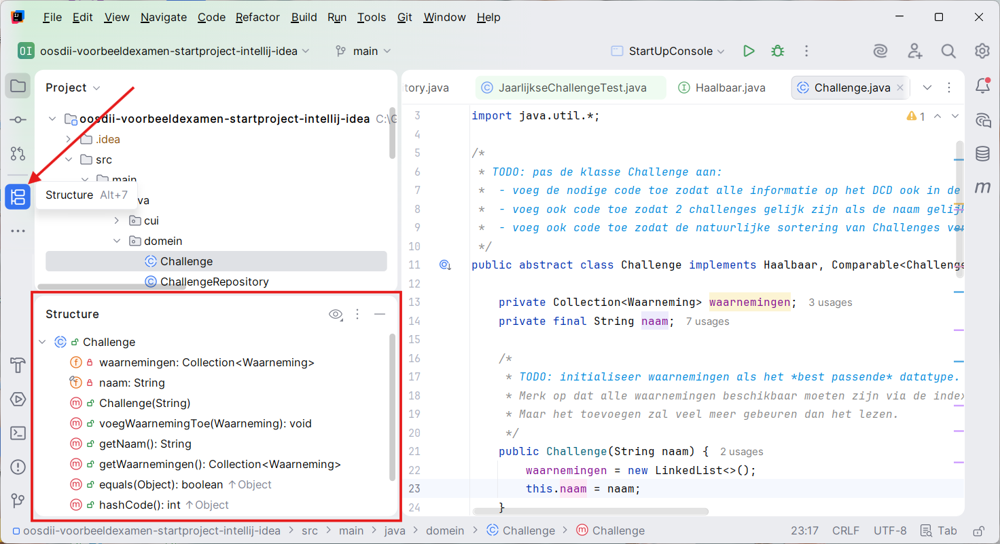

---
---
# Een project verkennen

## De projectstructuur

Wanneer je een project opent, wordt de project explorer links automatisch getoond.

- Je kan deze zelf ook tonen/verbergen door op het folder-icoon links (1) te klikken.
- De klassen bevinden zich onder `src/main/java` (2).

## De structuur van een klasse

Om een overzicht te krijgen van de attributen en methodes in een geopende klasse (handig als je met een UML-diagram wil vergelijken), klik je op het diagram-icoon links:

