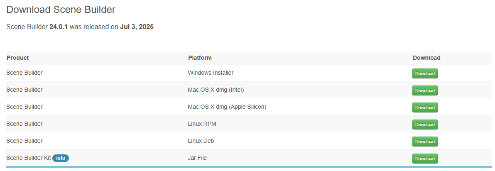
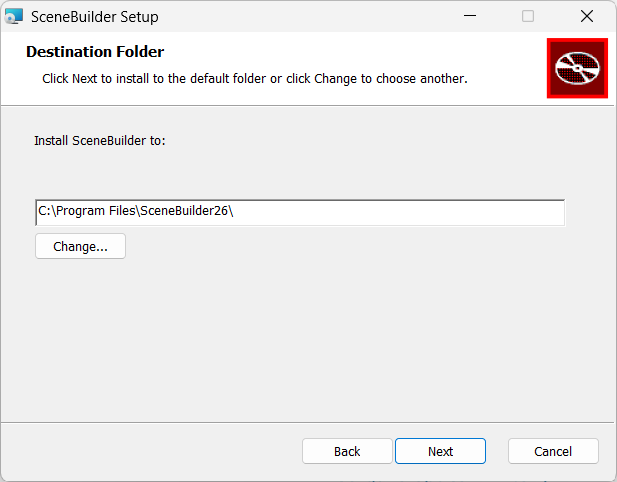
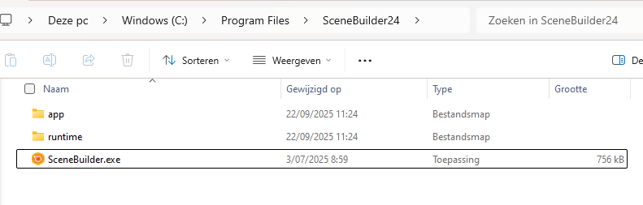

---
---
# Installatie Scene Builder 24

Ga naar <https://gluonhq.com/products/scene-builder/>

Download de juiste versie voor je besturingssysteem:

Maak een nieuwe map, bv. `C:\Program Files\SceneBuilder24`

Open de installer en volg de stappen, kies je map als Destination Folder:

Na installatie:

