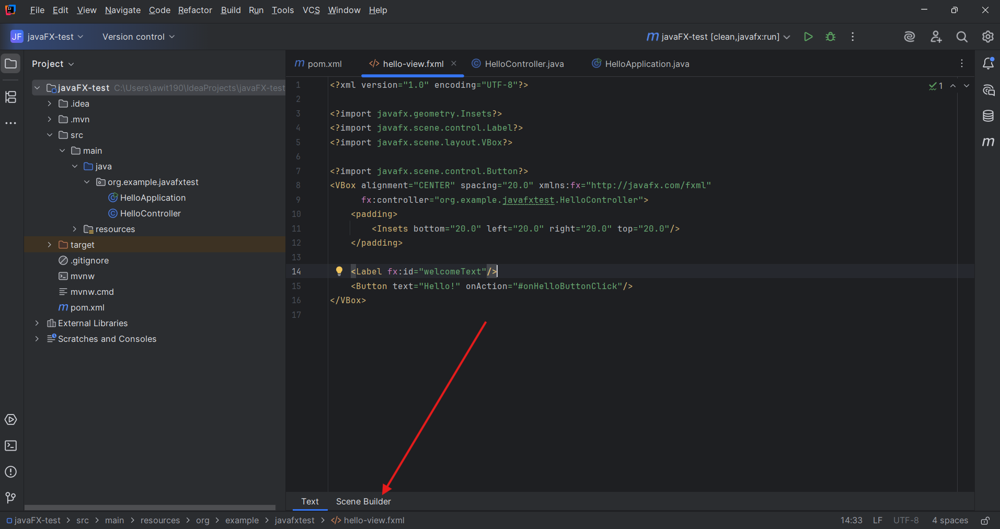
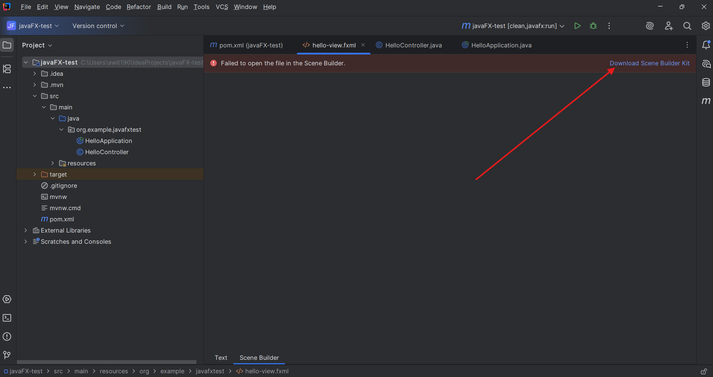
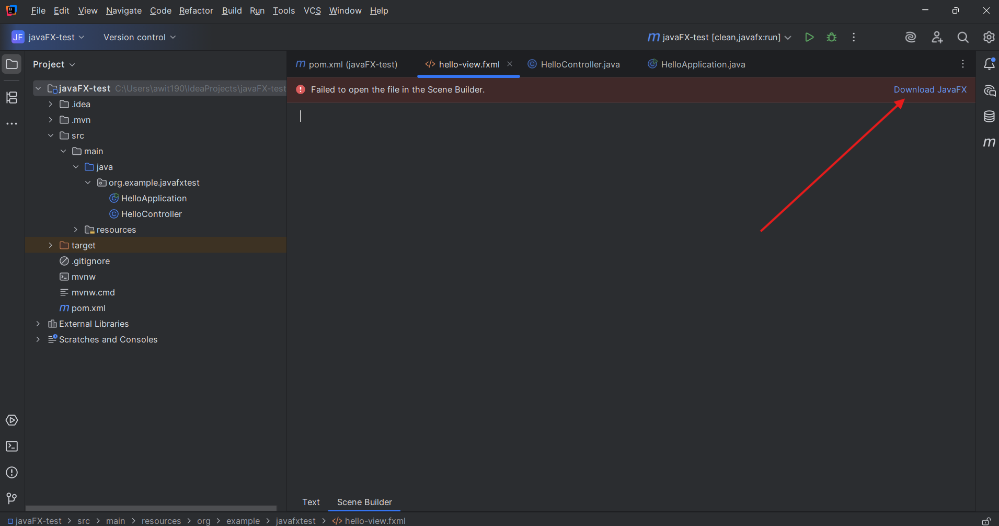
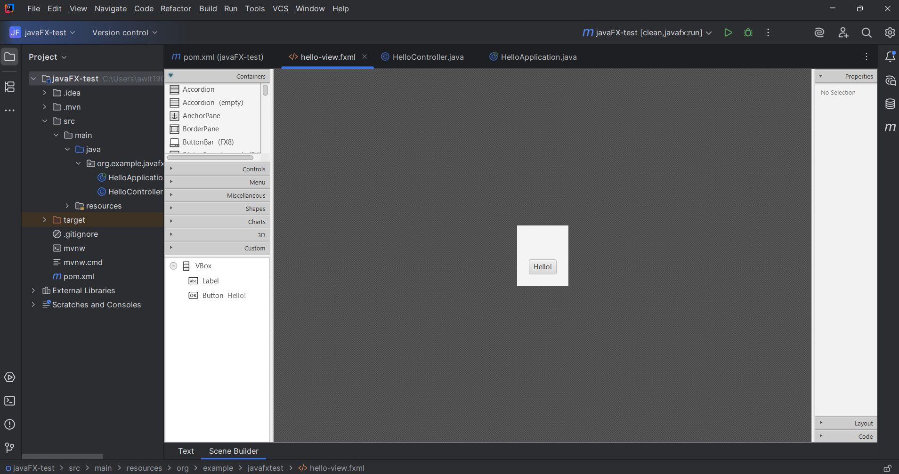
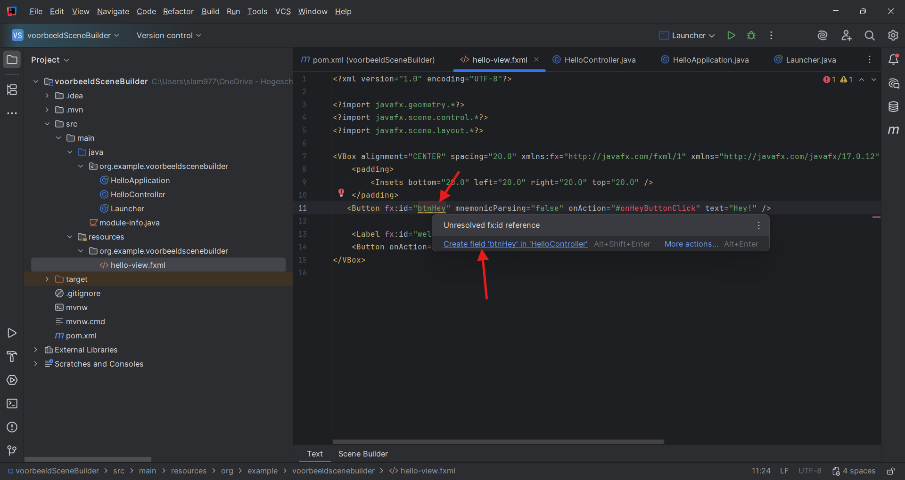
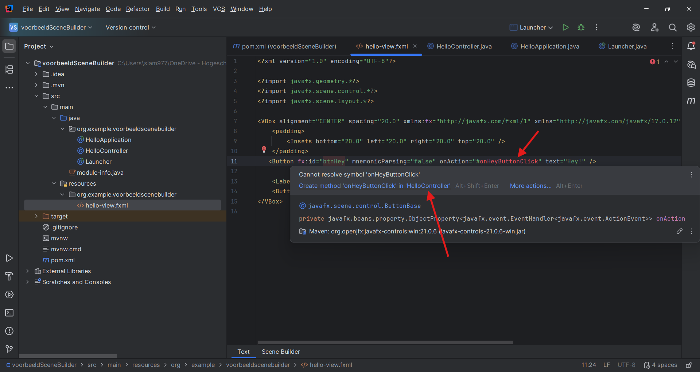
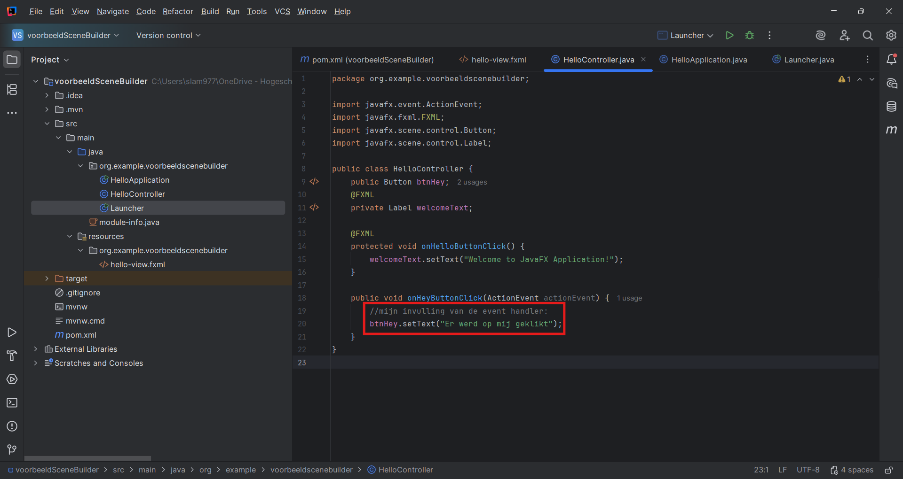

---
---
# Werken met Scene Builder integratie in IntelliJ

Scene Builder wordt in OOSDII enkel gebruikt in hoofdstuk 5, maar kan ook nuttig zijn voor (latere) projecten.

**Tip**: wanneer je een JavaFX-project aanmaakt in IntelliJ, wordt dit standaard gemaakt o.b.v. een fxml-bestand. Je vindt dit onder "main/resources" en je kan het bewerken met Scene Builder zoals hieronder beschreven staat.

Als eerste moet je naar een `.fxml` bestand gaan.
Wanneer je dit opent, dan heb je onderaan (zie pijl) de optie om deze tekstueel te openen (default) of in Scene Builder.
Klik op de tab "Scene Builder".

Wanneer je voor de eerste keer op de tab klikt, krijg je een scherm met een foutboodschap.
Klik rechts op de knop "Download Scene Builder Kit".

Vervolgens krijg je mogelijk nog een foutboodschap.
Klik op de knop "Download JavaFX".
Dit is op het eerste zicht wat vreemd, maar het gaat over de Windows-distributies van de javafx jars.

Tot slot zie je de geïntegreerde Scene Builder.

Wanneer je elementen toevoegt in Scene Builder (zoals beschreven in de cursus OOSDII) en daarna terugkeert naar de "Text" view, zie je warnings (geel onderlijnd) en errors (rode tekst) die aangeven welke variabelen en methodes nog niet gedefinieerd zijn in je Controller. Door erboven te hoveren, kun je de ontbrekende elementen automatisch laten toevoegen:

De fx:id's en event handlers zijn vanaf nu gekend in de Controller. Je kan de event handlers een invulling geven, bijvoorbeeld:

